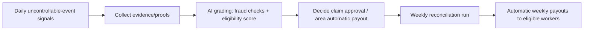

## GigGuard Gig-Worker Insurance Platform

GigGuard provides weekly insurance to gig workers (delivery drivers) of instant delivery apps such as Zepto, Blinkit, and similar services. Coverage applies when the worker incurs a loss due to uncontrollable events that prevent normal delivery operations.

To prevent fraud, every claim (and every automatic payout eligibility decision) is evaluated using evidence-based checks and an AI grading system. Final eligibility is determined by comparing multiple proof sources, producing a “fraud vs genuine” outcome and a confidence score. Weekly reconciliation then triggers automatic payouts.

## Who it's for

- Delivery gig workers for instant delivery apps (examples: Zepto, Blinkit, and other local instant delivery platforms).

## Coverage (Weekly): Weekly Premiums and Weekly Insurance

Insurance is provided on a weekly basis. Workers pay weekly premiums, and coverage is evaluated continuously during the week using daily-updated signals. At the end of the week, approved claims and eligible automatic payout triggers result in money being granted automatically.

## Covered Loss Events (Uncontrollable Reasons)

Coverage covers losses caused by the following categories of uncontrollable events:

### 1. Environmental issues

- Heavy rain
- Extreme heat
- Floods
- Severe pollution

### 2. Social issues

- Unplanned curfews
- Local strikes
- Sudden market/zone closures
- Road closures
- Similar official restrictions or disruptions beyond the gig worker's control

### 3. City power outage (worker cannot reach the location)

- When there is a power outage in the city the worker makes deliveries for, such that the gig worker cannot reach the location or perform deliveries safely/reliably.

### 4. Cellular network / internet outage

- When cellular network or internet services are down in the area where the worker operates, preventing normal app usage and delivery workflows.

### 5. App outage (delivery app is experiencing an outage)

- When the delivery app itself experiences an outage that disrupts normal delivery operations.

## Fraud Prevention & Claim Verification (Evidence-Based Grading)

To ensure gig workers are not committing fraud, claims and automatic payout decisions are validated using a grading system that scores evidence and consistency across multiple data sources.

Some ways to check and grade include:

0. Verify that the delivery was not made from the app the worker normally works for (or reconcile evidence if multiple apps are involved).
1. Check weather and pollution conditions using weather APIs.
2. Check road closures and traffic jams using mapping/traffic data (for example, Google Maps data).
3. Check strikes and curfews using social posts from official government and police accounts for the area (for example, Twitter/X).
4. GPS validation (location consistency and plausibility for the claimed period).
5. Photos (if required for the claim type).

### How the grading works (high level)

- Evidence collection runs daily using multiple independent sources.
- The system compares evidence against the declared event and delivery timeline.
- A model produces an outcome such as “fraud” or “genuine” (and may also include a confidence/score).
- The week-end reconciliation process uses these outcomes to decide whether to approve claims and which automatic payouts to release.

## Automated Weekly Payouts (Serious Unavoidable Situations)

In addition to claim-based insurance, the platform automatically grants money for serious unavoidable situations. These triggers are kept up to date everyday using the latest signals. At the end of the week, money is handed out automatically for eligible areas and workers.

Automatic payout triggers include:

- Blackout of internet services in an area: money is given to all eligible gig workers in that area.
- Sudden strike or curfew in an area for the day.
- The delivery app is down.
- Area earning anomaly: if all gig workers in an area are not earning, the system treats this as a potential sign of an uncontrollable problem beyond individual workers' control.

These automatic decisions are also evaluated via an AI grading system to reduce fraud and avoid incorrect payouts.

## AI Grading System (Decision Inputs and Outputs)

### Inputs (proofs and signals)

- Weather and pollution signals (via weather APIs)
- Road closures and traffic jam signals (via mapping/traffic data sources)
- Official social signals for strikes/curfews (via official account posts)
- GPS validation evidence
- Photos where required
- App outage telemetry (delivery app availability)
- Area-level signals (for example: “no earnings across all workers” checks)

### Output (decision)

- Fraud vs genuine classification (or fraud likelihood)
- Eligibility for:
  - claim approval, and/or
  - automatic weekly payout release for an area/day
- A confidence score used for reconciliation and escalation/approval policies (implementation-specific)

## Data Sources & Integrations

- Weather APIs (weather, heat, flood-related indicators, pollution conditions)
- Mapping/traffic data (for road closures and traffic jams, e.g., Google Maps-derived data)
- Official government and police accounts (for curfews and strikes, e.g., Twitter/X posts)
- GPS evidence (worker location consistency)
- Photo evidence (when required)
- Delivery app outage signals (app availability/incident telemetry)

## Mermaid: End-to-End Flow (Signals to Weekly Payouts)

## Open questions

- Premium calculation method: how weekly premiums are set (rate card, risk factors, zones, duration, and any worker-level adjustments).
- Payout policy details: definitions of “serious” situations, payout amounts/limits, caps, and eligibility time windows.
- Evidence thresholds: the confidence/score thresholds used to approve claims automatically vs requiring extra verification.
- Area granularity: how zones are defined for “area-level” triggers and anomaly detection.
- Appeals and review: how disputes are handled if a claim or automatic payout is rejected.
