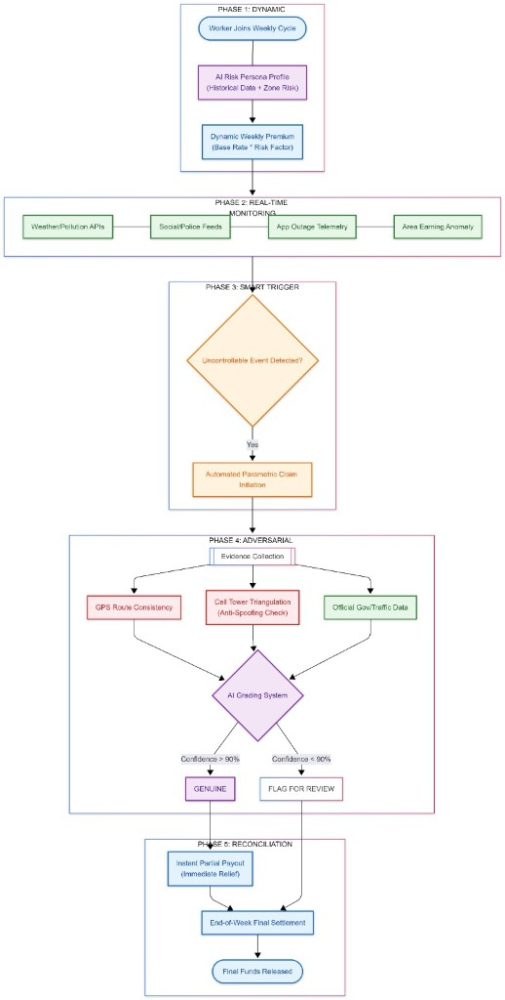

## GigGuard Parametric Insurance

GigGuard provides **weekly parametric insurance** to gig workers (delivery drivers) of instant delivery apps such as Zepto, Blinkit, and similar services.

Coverage applies when a worker’s ability to earn is impacted by **external, uncontrollable disruptions** (for example: extreme weather, social disruptions, city power outage, cellular/internet outage, or the delivery app itself experiencing an outage).

To prevent fraud, every claim (and every automatic payout eligibility decision) is evaluated using evidence-based checks and an AI grading system. Final eligibility is determined by comparing multiple proof sources, producing a “fraud vs genuine” outcome and a confidence score. End-of-week reconciliation then triggers (or finalizes) payouts.

## Persone Selected

- Delivery gig workers for instant delivery apps (examples: Zepto, Blinkit, and other local instant delivery platforms).

## Coverage (Weekly): Weekly Premiums and Weekly Insurance

Insurance is provided on a weekly basis. Workers pay weekly premiums, and coverage is evaluated continuously during the week using daily-updated signals. At the end of the week, approved claims and eligible automatic payout triggers result in money being granted automatically.

## Covered Loss Events (Uncontrollable Reasons)

Coverage covers losses caused by the following categories of uncontrollable events:

### 1. Environmental issues

- Heavy rain
- Extreme heat
- Floods
- Severe pollution

### 2. Social issues

- Unplanned curfews
- Local strikes
- Sudden market/zone closures
- Road closures
- Similar official restrictions or disruptions beyond the gig worker's control

### 3. City power outage

- When there is a power outage in the city the worker makes deliveries for, such that the gig worker cannot reach the location or perform deliveries safely/reliably.

### 4. Cellular network / internet outage

- When cellular network or internet services are down in the area where the worker operates, preventing normal app usage and delivery workflows.

### 5. App outage (delivery app is experiencing an outage)

- When the delivery app itself experiences an outage that disrupts normal delivery operations.

## Critical Constraints (Excluded Coverage)

This platform **must exclude** coverage for:

- Health insurance
- Life insurance
- Accident insurance
- Vehicle repairs or vehicle damage

## AI-Powered Risk Assessment (Weekly Dynamic Premiums)

Premiums are calculated on a **weekly basis** to align with gig-worker earnings cycles.

- **Weekly pricing basis:** the worker pays a weekly premium; the system evaluates risk signals throughout the week and reconciles weekly.
- **Dynamic premium calculation (weekly):** the premium for the upcoming week (and/or a week-level adjustment) is derived from predictive risk factors such as the worker’s typical delivery zones, historical disruption frequency, recent area conditions (weather/crowding proxies), and app/network stability patterns.
- **Persona-specific predictive risk modeling:** risk is personalized using signals relevant to the worker’s delivery persona (for example: frequent zones, typical shift timing, historical claim frequency, and exposure to past uncontrollable disruptions).

High level, this can be modeled as:

`weekly_premium = base_weekly_rate * (1 + disruption_risk_score(worker_persona, upcoming_week_area_signals))`

## Fraud Prevention & Claim Verification (Evidence-Based Grading)

To ensure gig workers are not committing fraud, claims and automatic payout decisions are validated using a grading system that scores evidence and consistency across multiple data sources.

Some ways to check and grade include:

1. **Duplicate claim prevention:** detect repeated/near-identical claims for the same worker, time window, and disruption signature.
2. **App/route misuse prevention:** verify the delivery was not made from the app the worker normally works for (or reconcile evidence if multiple apps are involved), so reported events match actual operational context.
3. **Anomaly detection in claims:** flag inconsistent patterns such as unusually frequent claims, mismatched timelines, or statistical outliers versus similar workers/areas.
4. **Weather & pollution verification:** check weather and pollution conditions using weather APIs.
5. **Traffic/road disruption verification:** check road closures and traffic jams using mapping/traffic data (for example, Google Maps-derived data or traffic feeds; mocks acceptable for early development).
6. **Social disruption verification:** check strikes and curfews using social posts from official government and police accounts for the area (for example, Twitter/X).
7. **Location and activity validation:** GPS validation (location consistency and plausibility for the claimed period) plus activity plausibility checks.
8. **Photos:** photos (if required for the claim type).

### How the grading works (high level)

- Evidence collection runs continuously and/or daily using multiple independent sources.
- The system compares evidence against the disruption signature and the delivery timeline.
- A model produces an outcome such as “fraud” or “genuine” (and includes a confidence/score).
- End-of-week reconciliation uses these outcomes to decide whether to approve claims and which automatic payouts to release/finalize.

## Automated Weekly Payouts (Serious Unavoidable Situations)

In addition to claim-based insurance, the platform uses **parametric automation** to:

- **Real-time trigger monitoring:** continuously monitor disruptions using external signals (weather, traffic, official postings, outage telemetry).
- **Automatic claim initiation:** when a supported disruption is detected, the system automatically creates/marks claims for affected workers/areas.
- **Instant payout processing:** eligible lost-income payouts are processed immediately (or near-instantly) for the detected disruption; final settlement is reconciled weekly.

Automatic payout triggers include:

- Blackout of internet services in an area: money is given to all eligible gig workers in that area.
- Sudden strike or curfew in an area for the day.
- The delivery app is down.
- Area earning anomaly: if all gig workers in an area are not earning, the system treats this as a potential sign of an uncontrollable problem beyond individual workers' control.

These automatic decisions are evaluated via the AI grading system to reduce fraud and avoid incorrect payouts.

## AI Grading System (Decision Inputs and Outputs)

### Inputs (proofs and signals)

- Weather and pollution signals (via weather APIs)
- Road closures and traffic jam signals (via mapping/traffic data sources)
- Official social signals for strikes/curfews (via official account posts)
- GPS validation evidence
- Photos where required
- App outage telemetry (delivery app availability)
- Area-level signals (for example: “no earnings across all workers” checks)

### Output (decision)

- Fraud vs genuine classification (or fraud likelihood)
- Eligibility for:
  - claim approval, and/or
  - automatic weekly payout release for an area/day
- A confidence score used for reconciliation and escalation/approval policies (implementation-specific)

## Data Sources & Integrations

- Weather APIs (weather, heat, flood-related indicators, pollution conditions)
- Mapping/traffic data (for road closures and traffic jams, e.g., Google Maps-derived data)
- Official government and police accounts (for curfews and strikes, e.g., Twitter/X posts)
- GPS evidence (worker location consistency)
- Photo evidence (when required)
- Delivery app outage signals (app availability/incident telemetry)
- Payment systems (mock/sandbox/trial versions acceptable for implementation)

## Integration Capabilities (Hackathon Friendly)

This project is designed so that early prototypes can use:

- Weather APIs: free tiers or mocks
- Traffic data: mocks acceptable
- Platform APIs: simulated delivery-app outage and worker/zone signals
- Payment systems: sandbox/mock payout processing

## End-to-End Flow Signals to Weekly Payouts)

- Backend API: claim ingestion, evidence collection, grading orchestration, and payout triggering (implementation-specific)
- Risk/Fraud models: anomaly detection + weekly risk scoring (AI/ML stack implementation-specific)
- Data storage: claims, workers, zones, evidence metadata, and grading outcomes (implementation-specific; e.g., SQL DB)
- External integrations: Weather APIs, traffic/road closures (e.g., Google Maps data), official social sources (Twitter/X), platform outage signals, GPS evidence, photo uploads
- Payments: sandbox/mock payout processing (trial integration)

# Adversarial Defense & Anti-Spoofing Strategy

If the worker’s GPS trace becomes untrustworthy (spoofed, replayed, or fabricated), the system should switch to **defense-in-depth** location and activity validation using multiple independent signals. The goal is not to rely on one “source of truth”, but to verify that the claim is consistent with the worker’s real operational activity and with externally observed disruption events.

1. Delivery/route plausibility without GPS
  - Validate that the claimed emergency occurred during an actually plausible delivery lifecycle (for example: within the worker’s active shift window, during an assigned job’s timeframe, or while the platform shows the worker as being in a specific zone).
  - Cross-check order/trip metadata (assignment time, pickup time, drop timeline, expected ETAs, zone IDs) against the reported disruption time window.
2. Network-based location inference (cell/WiFi/IP) instead of GPS
  - Use cell tower data (serving + neighbor towers, approximate area/zone mapping) and compare the implied zone with the claim’s expected delivery zone.
  - Optionally use WiFi scan results (SSID/BSSID fingerprints) when available, and compare to known zone-level fingerprints collected during onboarding.
  - Use IP geolocation only as a weak signal, but require agreement with cell-based zone inference when possible.
3. Device integrity and anti-spoof posture
  - Require device attestation / integrity checks (e.g., “app running on a non-tampered device”) to reduce the chance of fully simulated sensor/app data.
  - Detect rooted/jailbroken environments and treat claims from those devices as “needs extra verification” rather than auto-rejecting (to handle edge cases).
4. Activity validation using motion and time consistency
  - Use accelerometer/gyroscope summaries (movement vs stationary) to confirm that the worker’s “being unable to reach location” story matches the physical plausibility of sensor readings across the claimed time window.
  - Check for timestamp anomalies (clock drift, impossible sequences, repeated time windows) and “replayed evidence” patterns.
5. Cross-proof consistency + confidence scoring (GPS becomes optional)
  - Even if GPS is wrong, the claim should still align with external parametric triggers (weather/traffic/social outage signals) and the inferred network zone.
  - Compute a fraud score from the agreement between: network zone, delivery lifecycle metadata, external disruption signals, and optional photo evidence.
  - If confidence is low, downgrade payout speed (instant -> delayed/weekly) and route the claim to human/secondary review.
6. Duplicate claim and fraud-ring prevention
  - Block duplicate/near-duplicate claims by hashing claim content + disruption signature + time window (and optionally device/network fingerprints).
  - Flag repeated patterns across multiple accounts that share identical evidence artifacts or abnormal network footprints.

## Practical rule of thumb

Treat GPS as **one** input, not the foundation. When GPS conflicts with independent signals (cell/WiFi + delivery lifecycle metadata + disruption parametric evidence), do not pay instantly—escalate based on the fraud confidence score.
